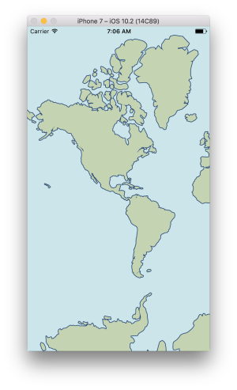
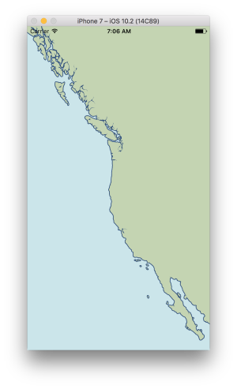

# SwiftVectorTiles
A Swift encoder for vector tiles according to the [Mapbox vector tile spec](https://github.com/mapbox/vector-tile-spec)

### Acknowledgements
* [Java Vector Tiles](https://github.com/ElectronicChartCentre/java-vector-tile)
* [GEOS & JTS](https://trac.osgeo.org/geos/)
* [Mapbox Vector Tile Spec](https://github.com/mapbox/vector-tile-spec)
* [Swift Google Protocol Buffers](http://protobuf.io/#swift)

### Status
Beta - expect a few bugs

### Cocoapods
```ruby
use_frameworks!

target 'YourTarget' do
  pod 'SwiftVectorTiles', :git => 'https://github.com/manimaul/SwiftVectorTiles.git'
end
```

### Example

```swift

// initialize an encoder
let encoder = VectorTileEncoder()

// create some attributes
var atts = [String: Attribute]()
atts["some_key"] = Attribute.attString("some_value")

// polygon geometry "well known text"
let wkt = "POLYGON ((0 0, 4096 0, 4096 4096, 0 4096, 0 0))"

// add the geometry and it's attributes as a "feature"
encoder.addFeature(layerName: "land", attributes: atts, geometry: wkt)

// encode to Mapbox vector tile
let data :Data = encoder.encode()

```

### Screenshots

| Encoded [Natural Earth Data](http://www.naturalearthdata.com/) geometries| |
| --------------------------------------------- | ---------------------------------------- |
|||
